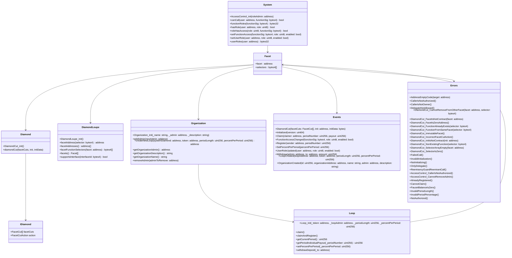

## System diagrams

> **NOTE** As a reminder, `system` follows the diamond structure, so you **WON'T** find most of the functions on the desired contract. Those functions are being delegated to other contracts (ej. `DiamondCutFacet`).

