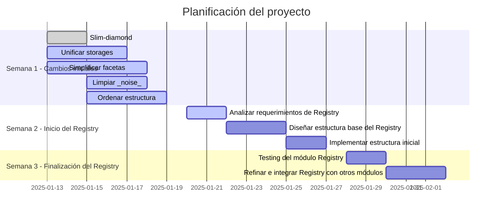
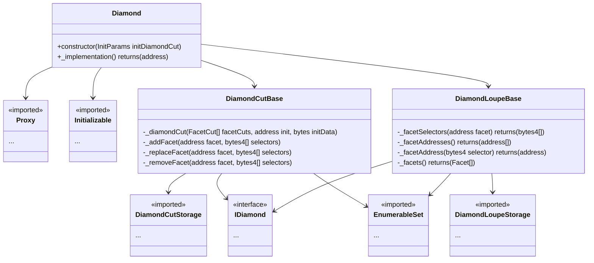
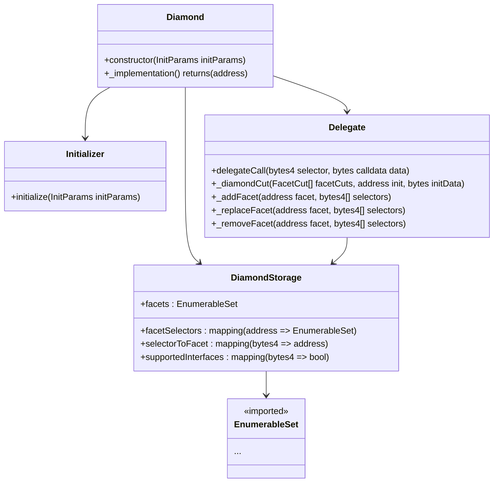

# Que cosas quiero hacer aca ?

## Paso 0 : plan
1. [x] Revisar donde estamos parados?
  - Tenemos un diamante (`opinionarlo`)
  - Tenemos un setup inicial
  - Tenemos algunos tests (`muchos se rompen`)
```bash
Ran 8 test suites in 139.44ms (90.20ms CPU time): 8 tests passed, 13 failed, 0 skipped (21 total tests)
```
- Tenemos buenos ejemplos de varias cosas
  - Access control, para que se usa? Ok ya lo entendí, usa los operadores de bits para tener controlados los roles
  - Las faceta {`FacetCut`} **NO** tiene implementado accesos de control : **PROBLEMA**
  - Para que tenemos `DiamondLoupeStorage` y `DiamondCutStorage` en 2 instancias separadas ?
  - Para que hacemos la separación de `___Base.sol` y la implementación ?
  - El diamante tiene código redundante (en mi opinion) porque *debería* ir todo en facetas.
  - Que rol cumple el facet registry ??

2. [ ] Cambios propuestos :
  - [ ] `Slim-diamond` : un diamante que tenga **SOLO** inicializar && `delegate`
  - [ ] **Unificar** los storages de `DiamondLoupeStorage`, `DiamondCutStorage` -> `DiamondStorage`
  - [ ] **Simplificar** la estructura de las facetas sobre compleja : que ahora sea **SOLO** `storage` + `implementación`
    - `lib_st`
    - `modifers` (si aplica)
    - `implementación`
  - [ ] **SACAR** el _noise_ que hay
    - la carpeta `registry` para que sirve??
    - por que hay llamadas internas ??? cuando **pueden** ser lecturas del storage?
    - `Facet` no esta medio **OP** ? Creo que s epuede simplificar bastante ya que las cosas que hace son medias redundantes
  - [ ] **Ordenar** la estructura, los helpers **NO** pueden ir en la carpeta de tests si se van a usar como scripts
  - [ ]

### Plan propuesto :
#### Actions

#### Diamante
- **Actual**

- **Propuesto**

## Paso 2
**Objetivos:**
- Implementar un módulo Registry que se integre con la estructura base del diamante.
- Configurar los métodos para agregar, eliminar y consultar datos de registro.
- Crear un LoopRegistry que permita instanciar múltiples diamantes mínimos con configuraciones específicas.
- Preparar el sistema para asociar diamantes a organizaciones en el próximo paso.
- Garantizar que el diseño sea extensible, eficiente y fácil de mantener.

**Tareas Detalladas**
1. Análisis de Requerimientos

- Definir los Datos del Registry:
 - Manejo de datos genéricos como usuarios, contratos, configuraciones y asociaciones.
 - Los datos estarán estructurados para soportar instancias múltiples (Loops).
- Interfaces Necesarias:
 - Métodos básicos para manejar entradas (agregar, eliminar, consultar).
 - Métodos avanzados para instanciar diamantes mínimos.
- Diseñar las Funciones:
 - addEntry: Agregar un nuevo elemento al registro.
 - removeEntry: Eliminar un elemento existente.
 - getEntry: Consultar un elemento en particular.
 - listEntries: Listar todos los elementos registrados.
- Loop Functions:
 - createLoop: Instanciar un nuevo diamante mínimo (Loop).
 - initializeLoop: Inicializar una instancia de Loop con datos específicos.
 - linkLoopToOrganization: Asignar un Loop a una organización
